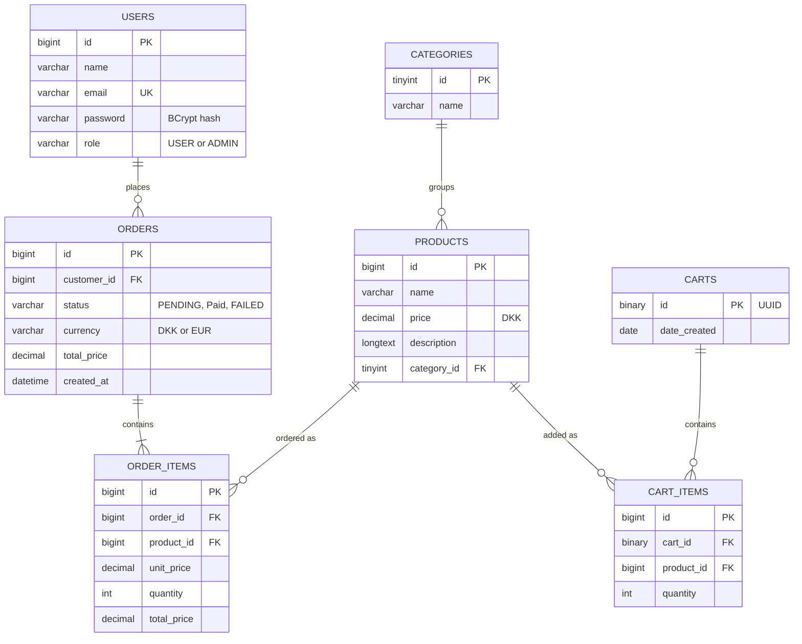
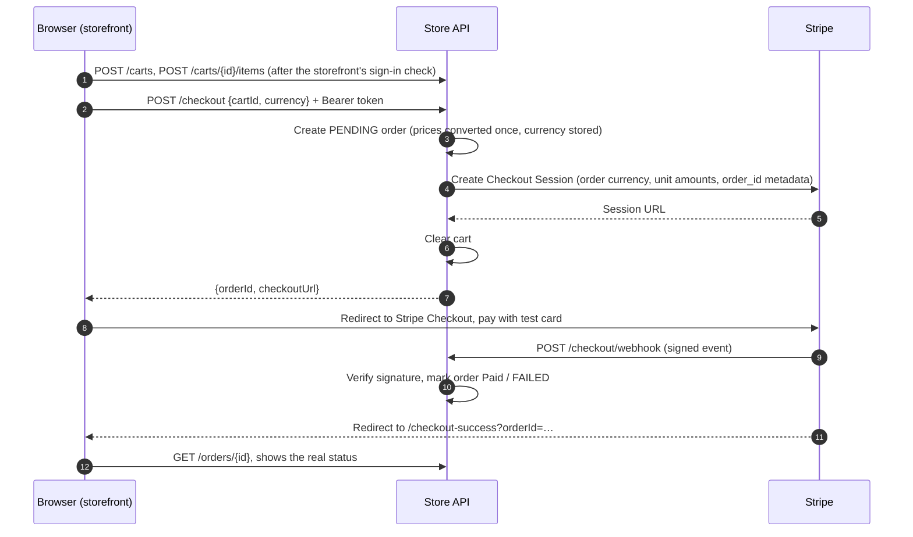

# Store API – Spring Boot E-Commerce Backend

A full-stack e-commerce application built around a **Spring Boot REST API**:
JWT authentication with USER/ADMIN roles, a product catalogue, guest carts,
Stripe Checkout with signature-verified webhooks, orders that remember the
currency they were charged in (DKK or EUR), and a Flyway-versioned MySQL
schema.

A server-rendered storefront (Thymeleaf + vanilla JavaScript) sits on top of
the same public API. It is the interface used to exercise and demonstrate the
backend. It is not a separate application with its own server-side logic.

---

## Try the Demo

> **Live demo:** <https://store-api-production-183a.up.railway.app>, deployed
> on Railway. Payments run in **Stripe test (sandbox) mode**: pay with the
> test card below. No real money is charged, and real cards can't be used.

**Shared public demo account.** These credentials are intentionally public
so anyone can try the store:

| | |
|---|---|
| Email | `demo@storeapi-demo.com` |
| Password | `2fhd-nX8Y-Wqkp-7USJ` |
| Role | `USER` (a normal customer, not an admin) |
| Payments | Stripe **test mode**. No real money is charged |
| Test card | `4242 4242 4242 4242`, any future expiry date, any CVC |

- This is a **shared, public account**. Everyone who logs in uses the same
  account and sees the same order history, so don't enter any real personal
  information.
- The account is **protected** and read-only from a visitor's point of view:
  its profile can't be changed, its password can't be changed and it can't
  be deleted. The account page labels it as a public demo account and
  doesn't offer Edit profile; direct API requests return `403` (see
  [Demo-account protection](#demo-account-protection)).
- There is intentionally **no public ADMIN account**. ADMIN functionality
  exists and is covered by tests, but admin credentials are kept private. The
  [authorization table](#authorization) documents what ADMIN can do.

---

## What This Project Demonstrates

- **REST API design** with Spring Boot: resource-oriented endpoints, DTOs,
  correct status codes (`201` + `Location`, `204`, `400`, `401`, `403`,
  `404`, `409`, `415`).
- **Authentication**: login with BCrypt-hashed passwords, short-lived JWT
  access tokens, and a long-lived refresh token in an `httpOnly` cookie.
- **Authorization**: `USER`/`ADMIN` roles enforced by Spring Security, plus
  **ownership checks**, so users can only read their own orders and account.
- **Catalogue and carts**: 58 products in 5 categories. The cart API
  identifies carts by UUID; the storefront requires a signed-in customer
  before anything is added to the cart.
- **Payments**: Stripe Checkout sessions created from server-side order
  data, and a **signature-verified Stripe webhook** that updates payment status.
- **Money handling**: DKK as the base currency, EUR derived in one backend
  service, and orders that keep the currency and amounts they were charged.
- **Persistence**: MySQL with **Flyway** migrations (V1–V7).
- **Robustness**: Bean Validation, a global exception handler that never
  leaks stack traces, and malformed JWTs treated as "not authenticated"
  instead of errors.
- **Operability**: OpenAPI/Swagger UI, and a Spring Boot Actuator health endpoint
  used by the storefront's status indicator and Railway's health check.
- **Automated testing**: 86 Maven integration and unit tests, plus 34
  Playwright browser tests.

The storefront (home, shop, product pages, cart, account, checkout result
pages) consumes this API from the browser.

---

## Tech Stack

| Area | Technology |
|---|---|
| Language / runtime | Java 21 |
| Framework | Spring Boot 3.4.1 (Spring Web, Spring Data JPA / Hibernate, Bean Validation, Actuator) |
| Security | Spring Security, JWT (jjwt 0.12.6), BCrypt |
| Database | MySQL (Connector/J), Flyway |
| Mapping / boilerplate | MapStruct 1.6.3, Lombok |
| Payments | Stripe Java SDK 33.3.0 (Stripe Checkout + webhooks) |
| API docs | springdoc-openapi 2.8.9 (Swagger UI) |
| Configuration | Environment variables; `.env` support via spring-dotenv 4.0.0 |
| Storefront | Thymeleaf, vanilla JavaScript (ES modules), CSS |
| Testing | JUnit 5, Spring MockMvc, H2 (in-memory), Playwright 1.63.0 |
| Build | Maven (wrapper included) |
| Deployment | Railway (live): app service + MySQL service; see [Railway Deployment](#railway-deployment) |

---

## Features

### Backend

| Feature | Details |
|---|---|
| Registration and login | `POST /users` creates a `USER` (password 8–25 chars, hashed with BCrypt, email must be unique). `POST /auth/login` returns an access token and sets the refresh cookie |
| JWT access tokens | HMAC-signed and valid for 2 hours. They carry the user id and role, and are sent as `Authorization: Bearer …` |
| Refresh token | `httpOnly` cookie scoped to `/auth`, valid for 7 days. `POST /auth/refresh` issues a new access token |
| Current user | `GET /auth/me` returns id, name, email and a `demoAccount` flag (true only for the configured shared demo account) |
| Account self-service | `PUT /users/{id}` (name and email, both required; email must be lowercase), `POST /users/{id}/change-password` (requires the current password), `DELETE /users/{id}`. An account that has placed orders can't be deleted (`409`), so its order history stays intact |
| Roles | `USER` and `ADMIN`; see [Authorization](#authorization) |
| Ownership checks | Orders and user accounts are only accessible to their owner (admins may manage user accounts) |
| Products and categories | Public catalogue (`GET /products`, `?categoryId=`, `GET /products/{id}`); admin-only create, update and delete |
| Carts | `POST /carts` returns a UUID. Add items, change quantities, remove items and clear the cart. At API level these are guest carts (no owner, no login needed); the storefront itself only lets signed-in customers add to the cart |
| Checkout | `POST /checkout` (authenticated) turns a cart into a `PENDING` order and returns a Stripe Checkout URL |
| Orders | `GET /orders` and `GET /orders/{id}` return only the caller's own orders |
| Stripe webhook | `POST /checkout/webhook` verifies the Stripe signature, then marks the order `Paid` or `FAILED` |
| Currencies | DKK and EUR. `GET /currencies` exposes the configured rate; every order stores its currency |
| Validation and errors | Bean Validation on request DTOs; `GlobalExceptionHandler` returns consistent JSON errors |
| Health | `GET /actuator/health` returns only `{"status":"UP"}`, with no details |
| API documentation | Swagger UI and OpenAPI JSON, with a Bearer-JWT security scheme |

### Storefront

| Page / feature | Details |
|---|---|
| Home | Hero with an autoplaying featured-product reel, an autoplaying category reel (each card opens its filtered category), featured products |
| Navigation | Header links: Shop and Categories both open `/shop`, where categories are chosen with filter chips; About; Contact |
| Shop | All 58 products; category chips; live search that filters by name, description and category |
| Product detail | Photo, price, quantity, add to cart, Description / Details / Payment tabs, related products. Changing the quantity immediately updates the displayed price (unit price × quantity, in the selected currency) |
| Sign-in to shop | Browsing is open to everyone. A signed-out visitor who clicks Add to cart gets a "Log in to shop" prompt with **Log in** and **Create account**, both returning to the same page |
| Cart | Quantities, removal, totals in the selected currency, checkout (requires login). Each item's photo and name link to its product page |
| Login / Register | Backed by `/auth/login` and `POST /users` |
| Account / Orders | Profile, order history (each order in its charged currency), logout. Normal accounts get **Edit profile**: change name and email, change password, and delete the account (not possible once it has placed orders). The shared demo account is shown as read-only, without Edit profile |
| Checkout result pages | Success page that reads the order's real payment status; a cancel page |
| Currency selector | DKK / EUR in the header, remembered in the browser |
| Server status | Header indicator polling `/actuator/health` |
| Responsive design | Checked for layout overflow at 1440, 1024, 768, 375 and 320 px; mobile menu |
| Product photography | A WebP photo for every product |

---

## Backend Architecture

The code is organised **by feature** rather than by technical layer:

```text
com.kidforeverserkan.store
├── admin/        AdminController (ADMIN-only endpoint)
├── auth/         AuthController, JwtService, Jwt, AuthService, login and current-user DTOs
├── cart/         Cart, CartItem, CartController, CartService, CartRepository, DTOs, mapper
├── config/       SecurityConfig, JwtConfig, OpenApiConfig
├── currency/     SupportedCurrency, CurrencyService, CurrencyProperties, CurrencyController
├── exceptions/   GlobalExceptionHandler, ErrorDto, domain exceptions
├── filters/      JwtAuthenticationFilter, LoggingFilter
├── orders/       Order, OrderItem, OrderController, OrderService, OrderRepository, DTOs, mapper
├── payments/     CheckoutController, CheckoutService, PaymentGateway, StripePaymentGateway, StripeConfig
├── products/     Product, Category, ProductController, repositories, DTO, mapper
├── users/        User, Role, UserController, UserService, DemoAccountProperties, DTOs, mapper
└── web/          HomeController, StoreController (storefront page routes)
```

Inside each feature the usual layers apply:

```text
HTTP request → Controller → Service → Repository → Entity (JPA) → MySQL
                  ↑
      Request DTO (validated) ─ MapStruct mapper ─ Entity ─ MapStruct mapper → Response DTO
```

- **Controllers** handle HTTP concerns and return DTOs. Entities are never
  serialised directly. Cart, checkout, orders and currency go through
  services. The product and user controllers are simpler and call their
  repositories directly.
- **Services** hold the business rules: `CheckoutService` (cart → order →
  payment session), `OrderService` (ownership), `CartService`,
  `CurrencyService` (the only place prices are converted), `AuthService`
  (current user from the security context).
- **MapStruct** generates the DTO ↔ entity mappers. Server-controlled
  fields (`id`, `role`, `password`) are explicitly ignored when mapping
  client input.
- **Security**: `SecurityConfig` defines stateless URL rules.
  `JwtAuthenticationFilter` turns a valid Bearer token into an authenticated
  principal with a `ROLE_USER` or `ROLE_ADMIN` authority.
- **Exception handling**: `GlobalExceptionHandler` maps validation,
  type-mismatch, access-denied, not-found, unsupported-media-type and
  data-integrity errors to clean `4xx` responses. Anything else becomes a
  generic `500` with no stack trace. A few controllers add local handlers
  for their own domain exceptions.
- **Payments**: `CheckoutService` depends on a **`PaymentGateway`
  interface** (`createCheckoutSession(order)`, `parseWebhookEvent(request)`),
  and **`StripePaymentGateway`** is the Stripe implementation. The checkout
  logic is independent of Stripe, and tests can inspect exactly what would
  be sent to Stripe without calling it.
- **Currency**: `SupportedCurrency` (DKK base, EUR) and `CurrencyService`
  (convert, round, convert to minor units) are configured through validated
  `CurrencyProperties`. The app fails to start if the rate is missing or
  not positive.
- **Storefront assets**: `StoreController` only returns Thymeleaf page shells
  (`/shop`, `/shop/{id}`, `/cart`, …). All data is loaded in the browser from
  the REST API by the scripts in `static/js/`.

---

## Database Architecture

MySQL, versioned with **Flyway** migrations in `src/main/resources/db/migration`:

| Migration | What it does |
|---|---|
| `V1__initial_migration` | Base schema: `users`, `categories`, `products`, plus `addresses`, `profiles`, `wishlist` |
| `V2__create_cart_tables` | `carts` (binary UUID id) and `cart_items` (unique per cart + product; cascade on cart/product delete) |
| `V3__add_role_to_users` | `users.role`, `NOT NULL DEFAULT 'USER'` |
| `V4__add_order_tables` | `orders` and `order_items` |
| `V5__populate_database` | Seeds **5 categories** and **58 products** (prices in DKK) |
| `V6__add_unique_constraint_to_user_email` | Unique constraint on `users.email` |
| `V7__add_currency_to_orders` | `orders.currency` (`NOT NULL DEFAULT 'DKK'`, `CHECK IN ('DKK','EUR')`) |

- **Product prices are stored once, in DKK** (`DECIMAL(10,2)`).
- **Categories:** Electronics (20 products), Home & Kitchen (10), Books (10),
  Fitness (8), Office (10).
- **Order amounts** (`orders.total_price`, `order_items.unit_price` and
  `total_price`) are stored in the order's own `currency`.
- `addresses`, `profiles` and `wishlist` exist in the schema but aren't
  exposed through the API.



Carts deliberately have **no owner**. They are guest carts identified only
by their UUID (see [trade-offs](#known-trade-offs--future-improvements)).

---

## Authentication & Authorization

### Authentication flow

```text
Register   POST /users          → user stored with a BCrypt password hash, role USER
Login      POST /auth/login     → { "token": "<access JWT>" }  +  Set-Cookie: refreshToken (httpOnly, Path=/auth)
Use API    Authorization: Bearer <access JWT>
Expired?   POST /auth/refresh   → new access token, using the refresh cookie
```

| Token | Lifetime | Where it lives |
|---|---|---|
| Access token (JWT) | 2 hours | Response body; the storefront keeps it in `sessionStorage` |
| Refresh token (JWT) | 7 days | `httpOnly` cookie, `Path=/auth`, `Secure` in production |

- Passwords are hashed with **BCrypt**. Changing a password requires the
  current password.
- The access token carries the user id (`sub`) and `role`.
  `JwtAuthenticationFilter` validates the signature and expiry on every
  request.
- A missing, expired, malformed or tampered token is treated as
  *unauthenticated* (`401`), never as a server error.
- `401` means "not authenticated". `403` means "authenticated, but not
  allowed". Both return clean responses.
- **No self-promotion to ADMIN:** registration always assigns `USER`, the
  mappers ignore any `role` in request bodies, and no endpoint changes
  roles.

### Authorization

Authorization combines **URL rules** in `SecurityConfig` (`hasRole("ADMIN")`)
with **ownership checks** in services and controllers.

| Operation | Public | USER | ADMIN |
|---|:---:|:---:|:---:|
| Browse products: `GET /products`, `GET /products/{id}` | ✅ | ✅ | ✅ |
| Currency rates: `GET /currencies` | ✅ | ✅ | ✅ |
| Register, log in, refresh | ✅ | ✅ | ✅ |
| Guest cart operations: `/carts/**` | ✅ | ✅ | ✅ |
| Current user: `GET /auth/me` | ❌ 401 | ✅ | ✅ |
| Checkout: `POST /checkout` | ❌ 401 | ✅ | ✅ |
| Orders: `GET /orders`, `GET /orders/{id}` | ❌ 401 | own only | own only |
| Read, update or delete an account: `GET/PUT/DELETE /users/{id}` | ❌ 401 | self only¹ | any user |
| Change password: `POST /users/{id}/change-password` | ❌ 401 | self only¹ | any user² |
| List all users: `GET /users` | ❌ 401 | ❌ 403 | ✅ |
| Create / update / delete products: `POST /products`, `PUT/DELETE /products/{id}` | ❌ 401 | ❌ 403 | ✅ |
| Admin endpoint: `GET /admin/hello` | ❌ 401 | ❌ 403 | ✅ |
| Stripe webhook: `POST /checkout/webhook` | Stripe signature required | | |
| `GET /actuator/health`, Swagger UI | ✅ | ✅ | ✅ |

¹ Except the configured demo account, which can't be changed or deleted by its own users.
² Still requires the target account's current password.

The substantive ADMIN operations are **catalogue management** (create,
update, delete products) and **user administration** (list users, read,
update or delete any account). `GET /admin/hello` is a minimal endpoint that
proves the `/admin/**` rule. Admins do **not** get access to other users'
orders.

There is intentionally **no public ADMIN account**, and none is created by
migrations or code. An admin is a normal registered user whose `role` is set
to `ADMIN` directly in the database, and those credentials stay private.

### Demo-account protection

The email in `DEMO_ACCOUNT_EMAIL` (`store.demo.account-email`) marks the
shared public demo account. For that account, `PUT /users/{id}`,
`DELETE /users/{id}` and `POST /users/{id}/change-password` return:

```json
403 Forbidden
{ "error": "The public demo account can't be changed or deleted." }
```

Every other account keeps its normal self-service behaviour, and admins can
still manage the demo account. If the variable is empty, no account is
protected.

`GET /auth/me` also returns `"demoAccount": true` for that account, so the
storefront shows it as a read-only "Public demo account" and doesn't offer
Edit profile at all. That is only a UI courtesy: the 403s above are the
actual protection.

---

## Cart → Checkout → Stripe → Webhook → Order



1. The storefront asks visitors to log in before they can add anything to
   the cart. The cart API itself identifies carts only by UUID and needs no
   account. Checkout requires login, so every order belongs to a user.
2. `CheckoutService` builds the order in one transaction: each DKK unit
   price is converted to the chosen currency once, and the total is the sum
   of the converted lines.
3. The Stripe session is built **from the order**, not from anything the
   browser sends: same currency, same per-unit amounts, and `order_id` in
   the PaymentIntent metadata. If Stripe fails, the order is removed and the
   API returns an error.
4. Stripe calls the webhook. `payment_intent.succeeded` sets the order to
   `Paid`, and `payment_intent.payment_failed` sets it to `FAILED`. Other
   events are ignored.
5. The success page loads the order and shows its **actual status**. It says
   "waiting for Stripe" until the webhook has arrived.

**Why a webhook instead of trusting the redirect:** anyone can open the
success URL, and a browser can close before the redirect happens. The webhook
is a server-to-server message from Stripe, and its **signature is verified**
with the webhook signing secret (`Webhook.constructEvent`). A missing or
invalid signature returns `400` and the order is left unchanged.

---

## Currency Handling

- **DKK is the base currency.** Every product price is stored once, in DKK.
- **EUR is derived** with a fixed, configurable demo rate:
  `store.currency.dkk-to-eur-rate: 0.1340` in `application.yaml`
  (overridable with `STORE_CURRENCY_DKKTOEURRATE`). It is **not** a live
  exchange-rate feed.
- **Conversion happens in exactly one place:** `CurrencyService`. It converts
  the unit price, rounds half-up to 2 decimals, and computes line totals as
  unit × quantity. The storefront reads the rate from `GET /currencies` and
  uses the same rule, so the site and Stripe show the same numbers.
- **Stripe receives the selected currency** (`dkk` or `eur`) with amounts in
  minor units (øre or cents). Checkout accepts only `DKK` or `EUR`; any other
  value is rejected with `400`, and an omitted currency means DKK.
- **Orders keep their currency.** Each order stores `currency` and the
  already-converted amounts. The order history and success page format each
  order in its own currency, so historical orders never change when the
  visitor switches the header selector or the configured rate changes.

---

## Testing

### Maven (JUnit 5 + MockMvc): 86 tests in 14 classes, all passing

| Area | Test class (tests) | What it verifies |
|---|---|---|
| Authentication | `AuthAndRegistrationTests` (11) | Register (valid, duplicate email, short password), login (valid, wrong password), `/auth/me`, garbage Bearer token → 401, refresh without or with an invalid cookie → 401, 415 handling |
| RBAC / admin | `AdminEndpointTests` (6) | `/admin/hello` returns 401/403/200 for anonymous/USER/ADMIN; a USER can't list users or read another user; unknown path → 404 |
| Products | `ProductAccessControlTests` (11) | Public reads; admin-only create, update and delete; validation; non-numeric id → 400; unknown id → 404; a client-supplied `id` can't overwrite a product |
| Cart | `CartFlowTests` (7) | Create, add, update, remove; unknown cart/product; the whole flow works without authentication |
| Checkout and orders | `CheckoutAndOrderTests` (11) | Empty or unknown cart → 400; DKK, EUR and default-currency orders; unsupported currency → 400; owner vs. other user (403); users only see their own orders |
| Stripe webhook | `StripeWebhookTests` (5) | Valid signed events mark orders Paid/FAILED (including EUR); invalid or missing signature → 400 and the order is unchanged |
| Stripe currency | `StripeCheckoutCurrencyTests` (3) | The session parameters Stripe would receive: currency, per-unit minor amounts, `order_id` metadata |
| Currency | `CurrencyServiceTests` (9), `CurrencyControllerTests` (2) | Rates, rounding, minor units, unsupported codes, public read-only `/currencies` |
| Demo account and self-service | `DemoAccountProtectionTests` (14) | The demo account can't be updated, deleted or re-passworded; normal users can update, re-password and delete themselves but not another user; admins keep their behaviour; blank, missing or uppercase profile fields → 400; `/auth/me` flags only the demo account |
| Health | `HealthEndpointTests` (2) | Health is public and reports only its status; other Actuator endpoints aren't exposed |
| Web pages | `StoreControllerTests` (3), `HomeControllerTests` (1), `StoreApplicationTests` (1) | Storefront pages are public; `/orders` serves HTML or JSON depending on the `Accept` header; the context loads |

The Maven tests run against an **in-memory H2 database** (MySQL mode) with
Hibernate `create-drop` and **Flyway disabled**, and they use dummy Stripe
and JWT settings. `mvnw test` therefore needs no MySQL, Stripe account or
`.env` file. **Limitation:** the Flyway migrations themselves are not
exercised by this suite.

### Playwright (browser): 34 tests, all passing

`e2e/tests/storefront.spec.js` runs in Chromium against a **locally
running** application. It covers:

- home page, hero and both reels: auto-advance and looping; hover and the
  Next/Previous arrows don't pause autoplay; Pause stops it and Play resumes
  it; reduced motion
- the header's Categories link opening the shop
- search: live filtering, URL sync, dropdown, no results, mobile menu
- currency switching and persistence
- signed-out Add to cart showing the login prompt (no cart is created), and
  logging in from the prompt back to the product
- add to cart (signed in) from cards, the product page and the home page,
  including recovery from a stale cart id
- the product page price following the chosen quantity
- cart item photo and name linking to the product page
- the account page, signed in and signed out; editing name and email;
  changing the password; deleting the account; the read-only demo-account
  view
- product detail tabs
- product images: every product shows its own photo and every book its own
  cover, and the emoji fallback works
- no horizontal overflow at the supported widths
- the offline status indicator

Any unexpected console error fails the test. The offline, stale-cart and
password tests deliberately provoke errors and allow them.

> Tests that need a signed-in shopper register their own
> `qa-e2e-…@example.com` user and delete it again afterwards. The guest carts
> they create stay in the database, because the API can't delete carts. Run
> the suite against a local database only.

There is **no CI pipeline**. Both suites are run manually.

---

## API / Swagger

Live deployment:

- Swagger UI: <https://store-api-production-183a.up.railway.app/swagger-ui/index.html>
- OpenAPI JSON: <https://store-api-production-183a.up.railway.app/v3/api-docs>

With the application running locally:

- Swagger UI: `http://localhost:8080/swagger-ui/index.html`
- OpenAPI JSON: `http://localhost:8080/v3/api-docs`

To call protected endpoints from Swagger UI:

1. Run `POST /auth/login` with an email and password, and copy `token` from
   the response.
2. Click **Authorize** and paste the token into the `bearerAuth` field.
3. Requests are now sent with `Authorization: Bearer <token>`.

---

## Storefront

The storefront is deliberately simple technology on top of the API:

- **Thymeleaf** page shells rendered by `StoreController` / `HomeController`
- **vanilla JavaScript ES modules** (`static/js/`), with one module per page
  plus shared ones: API client, navigation, currency, product cards, search,
  the sign-in prompt for shopping
- **plain CSS** (`static/css/style.css`) with design tokens
- **no React, Vue or Angular, and no frontend build pipeline**

All product, cart, order and account data comes from the REST API. The
shared client (`api.js`) attaches the Bearer token, and on a `401` it tries
the refresh cookie once before giving up.

The visual direction is a dark, "night showroom" style: deep navy, a single
electric-blue accent, the Manrope typeface, and a custom Store API logo (a
shopping bag holding `</>`). The storefront includes:

- product photography
- a DKK/EUR selector
- a live server-status indicator
- responsive layouts down to phone widths with a mobile menu
- two autoplaying reels on the home page (featured products and
  categories). Only their **Pause** button stops autoplay, and **Play**
  resumes it. Hover, focus, touch and the arrows never pause them. The timer
  also rests while the tab is hidden or the reel is scrolled out of view,
  and carries on by itself, without changing the Play/Pause state.
- `prefers-reduced-motion` support: nothing autoplays; the category reel
  becomes a manual, scrollable row, and the featured product can still be
  stepped with Next

The approved design is documented in [`DESIGN.md`](DESIGN.md).

---

## Product Images

- **All 58 products have a photo**, served as **WebP** from
  `src/main/resources/static/images/products/`.
- Each product has **two sizes** (116 files in total), delivered with
  `srcset`/`sizes`, explicit width/height and lazy loading. Most book covers
  and a few tall products sit on a 4:3 canvas so they aren't cropped in
  landscape frames.
- Images are mapped by **product id and expected product name** in
  `static/js/product-visuals.js`. If a product's name doesn't match its
  mapping (for example on a differently seeded database), the storefront
  shows a category **emoji fallback** instead of a wrong photo.
- Images are decorative (`alt=""`): the product name is always shown as
  text next to them.
- The product photography is **AI-generated** for this project. The
  original source images are kept outside the served static folder and
  outside version control.

---

## AI-Assisted Development

This project was developed with **Claude Code** (Anthropic's AI coding
assistant) as a working tool. Using AI assistants effectively is part of
how I work, and I want to be transparent about where it was used.

Claude Code assisted with:

- **Storefront**: implementing the Thymeleaf templates, JavaScript modules
  and CSS design system, across several design iterations until I approved
  the final visual direction.
- **Product-image workflow**: preparing the AI-generated photography as
  responsive WebP assets and mapping them to products.
- **Backend implementation**: specific changes such as the demo-account
  protection, the `/auth/me` demo-account flag, profile-update validation,
  and a small code-polish pass (removing unused leftovers, fixing names).
  I specified, reviewed and verified each of them.
- **Testing**: writing and running integration and browser tests.
- **Reviews and audits**: security/RBAC reviews, repository clean-up, and
  deployment-readiness and documentation audits, including this README.
- **Deployment**: the Railway and Stripe test-mode setup through their CLI
  and API, and the production smoke test, which I directed and approved
  step by step.
- **Development tooling**: local database inspection and clean-up, and
  test runs.

My role was to direct the project. The backend is the core of this
portfolio: its architecture, database design, business rules,
authentication and authorization model, payment flow and currency handling
are my project's design, built on the course project it started from (see
[Course / Learning Origin](#course--learning-origin)). I defined the requirements, made the engineering
and design decisions (for example the DKK/EUR model, keeping ADMIN
credentials private, requiring sign-in to shop, and protecting the shared
demo account), reviewed
the changes, tested the application myself, and iterated until each part
behaved as intended. The project's history is not a split of "written by
hand" versus "written by AI". It reflects a workflow where AI assistance is
directed, reviewed and verified.

---

## Local Development

### Prerequisites

- **Java 21** (JDK)
- **MySQL 8** running on `localhost:3306`
- A **Stripe test-mode** account (secret key; the
  [Stripe CLI](https://stripe.com/docs/stripe-cli) is useful for local webhooks)
- Node.js, only if you want to run the Playwright tests

The Maven wrapper (`mvnw` / `mvnw.cmd`) is included, so no separate Maven
install is needed.

### Run (Windows / PowerShell)

```powershell
git clone https://github.com/kidforeverserkan/store-api.git
cd store-api

# 1. Configuration: copy the template and fill in your values
Copy-Item .env.example .env

# 2. Start the app with the dev profile
.\mvnw.cmd spring-boot:run "-Dspring-boot.run.profiles=dev"
```

The **`dev` profile is required** locally. It provides the local MySQL URL
(`jdbc:mysql://localhost:3306/store_api?createDatabaseIfNotExist=true`), the
local `websiteUrl` (`http://localhost:8080`), and turns off the `Secure`
flag on the refresh cookie, because local development runs over plain HTTP.
Without a profile the app fails with "Failed to configure a DataSource".

On first start, Flyway creates the schema and seeds the catalogue. The
storefront is then available at `http://localhost:8080`.

For local Stripe webhooks, forward events with the Stripe CLI and put the
signing secret it prints into `STRIPE_WEBHOOK_SECRET_KEY`:

```powershell
stripe listen --forward-to localhost:8080/checkout/webhook
```

### Tests

```powershell
# Maven: H2, no MySQL/Stripe/.env needed
.\mvnw.cmd test

# Playwright: needs the app running locally (its QA users delete themselves;
# the guest carts it creates stay in the local DB)
cd e2e
npm install
npx playwright install chromium
npx playwright test
```

---

## Environment Variables

The template is [`.env.example`](.env.example). Never commit real values;
`.env` is git-ignored.

| Variable | Required | Purpose |
|---|---|---|
| `DB_USERNAME` | Always | MySQL user |
| `DB_PASSWORD` | Always | MySQL password |
| `JWT_SECRET` | Always | HMAC-SHA256 signing key. **Must be at least 32 bytes** (256 bits), or token creation fails |
| `STRIPE_SECRET_KEY` | Always | Stripe secret key (test mode for the demo) |
| `STRIPE_WEBHOOK_SECRET_KEY` | Always | Signing secret of the Stripe webhook endpoint |
| `SPRING_PROFILES_ACTIVE` | Production | `prod`. Locally, start with the `dev` profile instead |
| `DB_URL` | Production | JDBC URL, e.g. `jdbc:mysql://host:3306/database` (JDBC form, not `mysql://…`) |
| `WEBSITE_URL` | Production | Public base URL (no trailing slash), used for Stripe's success and cancel redirects |
| `DEMO_ACCOUNT_EMAIL` | Optional | Email of the shared demo account to protect. Empty = no account protected |
| `STORE_CURRENCY_DKKTOEURRATE` | Optional | Overrides the fixed DKK → EUR rate (default `0.1340`) |

`PORT` is read automatically (`server.port: ${PORT:8080}`) and is provided
by Railway.

---

## Railway Deployment

> **Status: deployed.** The application runs on Railway at
> <https://store-api-production-183a.up.railway.app>, with Stripe in
> **test (sandbox) mode only**. It doesn't accept real payments.

### Current deployment

| Part | Configuration |
|---|---|
| Services | `Store API` (built from GitHub `main`, redeploys on push) and a `MySQL` database service, in one Railway project |
| Build | Railway's **Railpack** builder detects the Maven project and Java 21 from `pom.xml`, and starts the packaged jar |
| Runtime | Java 21, Spring profile `prod` |
| Health check | `/actuator/health`, set in the Railway service settings; Railway only marks a deployment healthy once it returns `200` |
| Database | A fresh MySQL database. `DB_URL`, `DB_USERNAME` and `DB_PASSWORD` are Railway reference variables pointing at the MySQL service (JDBC URL over Railway's private network). Flyway applied V1–V7 on the first start (schema version 7) |
| Secrets | `JWT_SECRET`, `STRIPE_SECRET_KEY` and `STRIPE_WEBHOOK_SECRET_KEY` exist only as Railway variables, never in the repository |
| Stripe | Test-mode webhook endpoint `/checkout/webhook` for `payment_intent.succeeded` and `payment_intent.payment_failed`, pinned to API version `2026-07-29.dahlia` (the version `stripe-java` 33.3.0 expects) |
| Demo account | Registered through the normal `POST /users` flow; `DEMO_ACCOUNT_EMAIL` protects it |

**Production smoke test (September 2026).** The following were verified
against the live deployment:
- Registration and login (storefront and API), `/auth/me` with the demo
  flag, the `USER` role, and `403` on admin endpoints.
- All 58 products and their 58 images, product pages, and DKK/EUR
  switching that persists across reloads and navigation.
- The cart and quantity totals.
- A real **Stripe test-mode** Checkout payment. Stripe delivered the
  webhook (`POST /checkout/webhook` → `200`), the order was marked `Paid`,
  and it appears in the order history in the currency it was charged in,
  even with the selector set to EUR.
- The demo-account guard, and `/actuator/health` → `200 {"status":"UP"}`.

**Notes from the deployment:**
- The live service does not use `railway.json`. Railway builds with
  Railpack, and the health check lives in the service settings. The file
  stays in the repository as a record of the intended configuration.
- Flyway logs a warning that MySQL 9.4 (Railway's MySQL image) is newer than
  the MySQL versions it has been tested with. The migrations ran without
  problems.

### Deploying your own copy

1. **Services.** Create a Railway project with a MySQL service and a service
   from this repository.
2. **Build and health.** Railpack detects Java 21 from `pom.xml`. Set the
   service's health-check path to `/actuator/health`.
3. **Database variables.** Point `DB_URL`
   (`jdbc:mysql://${{MySQL.MYSQLHOST}}:${{MySQL.MYSQLPORT}}/${{MySQL.MYSQLDATABASE}}`),
   `DB_USERNAME` and `DB_PASSWORD` at the MySQL service with reference
   variables. Don't use `MYSQL_URL`, which is in `mysql://` form.
4. **Other variables.** Set `SPRING_PROFILES_ACTIVE=prod`, `JWT_SECRET`
   (at least 32 bytes), `DEMO_ACCOUNT_EMAIL`, and `WEBSITE_URL` (the
   generated public domain). The app won't start until both Stripe
   variables are set as well.
5. **Stripe webhook.** In Stripe **test mode**, add an endpoint
   `https://<your-domain>/checkout/webhook` for `payment_intent.succeeded`
   and `payment_intent.payment_failed`, with API version
   `2026-07-29.dahlia`. Set its signing secret as
   `STRIPE_WEBHOOK_SECRET_KEY`, and the test secret key as
   `STRIPE_SECRET_KEY`.
6. **Demo account.** After the app is healthy, register the demo customer
   through `POST /users` with the email in `DEMO_ACCOUNT_EMAIL`.

**Flyway note (V5):** the seed migration `V5__populate_database.sql` was
changed during development, when the catalogue grew to 58 products. A
**fresh** database migrates normally, and the live deployment uses one. A database that already applied an
earlier version of V5 fails Flyway's checksum validation at startup. That
case needs a deliberate decision, such as starting from a new database, and
not a blind `flyway repair`, which would only accept the new checksum
without changing the data that was already seeded.

---

## Security

- **Passwords:** BCrypt hashes. Changing a password requires the current
  password.
- **Stateless JWT:** access tokens are signed and short-lived. Sessions are
  disabled (`STATELESS`). CSRF protection is disabled because API
  authentication uses Bearer tokens.
- **Refresh cookie:** `httpOnly`, scoped to `/auth`, `Secure` in production
  (turned off only in the local `dev` profile).
- **Role-based authorization:** `ROLE_ADMIN` required for `/admin/**` and
  all product writes; admin-only user listing; no way to self-assign ADMIN.
- **Ownership checks:** orders and user accounts are only accessible to
  their owner (plus admins for account management).
- **Malformed tokens:** any unparseable, tampered or expired JWT results in
  `401`, never `500`.
- **Webhook security:** the public webhook URL only accepts events with a
  valid Stripe signature.
- **Actuator:** only `health` is exposed, with `show-details: never`.
- **Secrets:** supplied through environment variables. `.env` is
  git-ignored and no secrets are committed.
- **Demo-account protection:** the shared demo account can't be changed,
  re-passworded or deleted by its users.
- **No public ADMIN credentials.**
- **Storefront:** the access token is kept in `sessionStorage`, not
  `localStorage`, and the login page only redirects to same-site relative
  paths.

---

## Known Trade-offs / Future Improvements

These are deliberate scope decisions for a portfolio project, not defects.

| Area | Current behaviour | Possible improvement |
|---|---|---|
| Guest carts | The storefront requires sign-in before adding to the cart, but at API level carts are still identified only by an unguessable UUID, with no ownership, so anyone with the id can use the cart | Attach carts to users after login |
| Refresh tokens | Stateless JWTs; not rotated or revocable server-side; logout clears the access token in the browser | Persisted and rotated refresh tokens, server-side logout |
| Exchange rate | Fixed, configured DKK → EUR demo rate | A live rate source with rate snapshots |
| Order status | `CANCELED` exists but is never set; abandoned Stripe sessions leave the order `PENDING` | Handle session expiry events |
| Cart at checkout | The cart is cleared when checkout **starts**, so a cancelled payment means rebuilding the cart (the cancel page says so) | Clear the cart only after a successful payment |
| Product images | Image metadata is hard-coded in the frontend (`product-visuals.js`) | Store image references with the product |
| Product listing | `GET /products` has no pagination | Pageable endpoints |
| CI | No CI pipeline; tests are run manually | GitHub Actions for Maven, and optionally Playwright |
| Migration testing | Maven tests use H2 with Flyway disabled, so migrations aren't tested | Testcontainers MySQL tests that run Flyway |

---

## Project Structure

```text
store-api/
├── src/main/java/com/kidforeverserkan/store/
│   ├── admin/  auth/  cart/  config/  currency/  exceptions/
│   ├── filters/  orders/  payments/  products/  users/  web/
│   └── StoreApplication.java
├── src/main/resources/
│   ├── application.yaml              # shared config (reads env vars)
│   ├── application-dev.yaml          # local MySQL, non-Secure cookie
│   ├── application-prod.yaml         # production datasource, forwarded headers
│   ├── db/migration/                 # Flyway V1–V7
│   ├── templates/                    # Thymeleaf pages + header/footer fragments
│   └── static/
│       ├── css/style.css
│       ├── js/                       # ES modules (API client, pages, shared UI)
│       └── images/products/          # 116 WebP product images
├── src/test/
│   ├── java/com/kidforeverserkan/store/   # 86 JUnit/MockMvc tests
│   └── resources/application.yaml         # H2 + dummy secrets for tests
├── e2e/                              # Playwright browser tests
├── design-reference/                 # approved storefront design reference
├── DESIGN.md                         # storefront design system
├── PRODUCT.md                        # product brief and "truth rules"
├── railway.json                      # Railway config-as-code (not applied by the live service; see Railway Deployment)
├── .env.example                      # environment variable template
└── pom.xml
```

---

## Course / Learning Origin

This project started from the e-commerce API built while following the
**CodeWithMosh** Spring Boot course. Since then it has been refactored into
feature packages and substantially extended into a personalised portfolio
application: the storefront, DKK/EUR support with persistent order currency,
role and ownership hardening, the demo-account protection, the automated
test suites and the deployment configuration. This README describes the
project as it exists today; it doesn't attempt to list what the course
itself covers.
